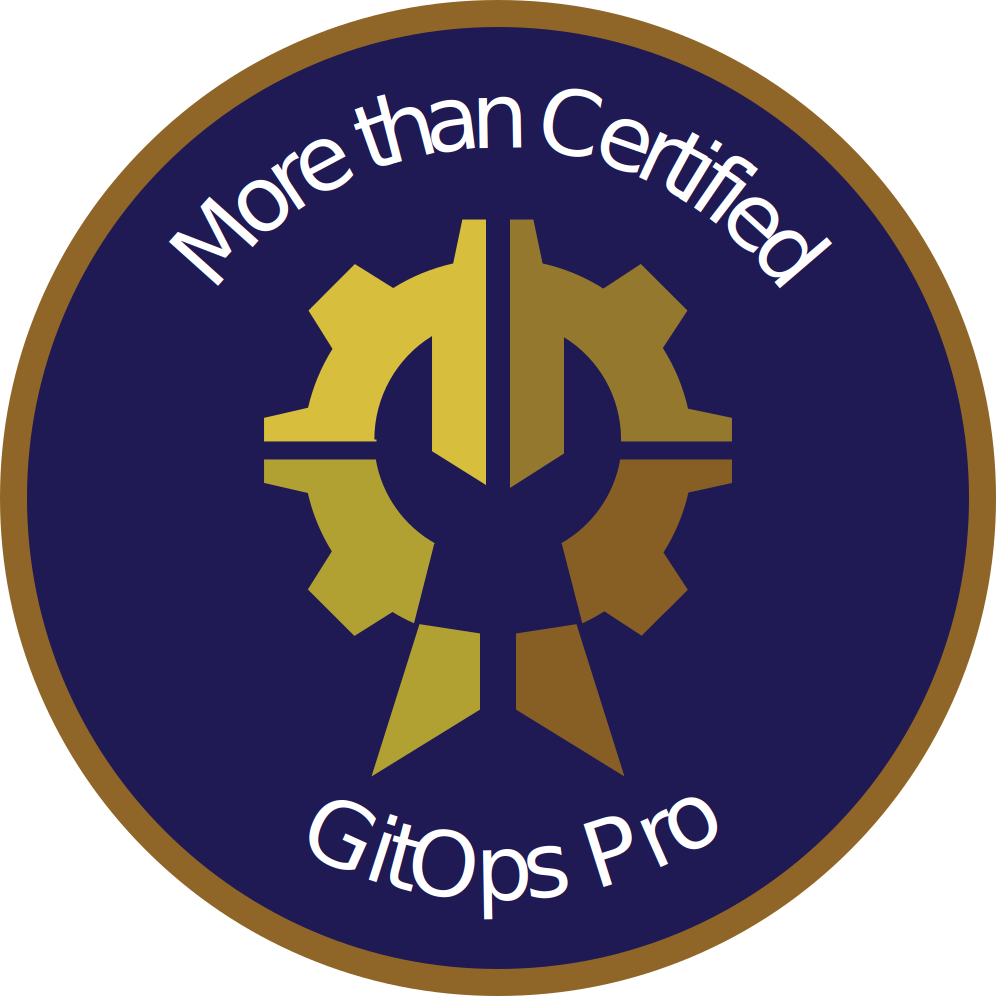
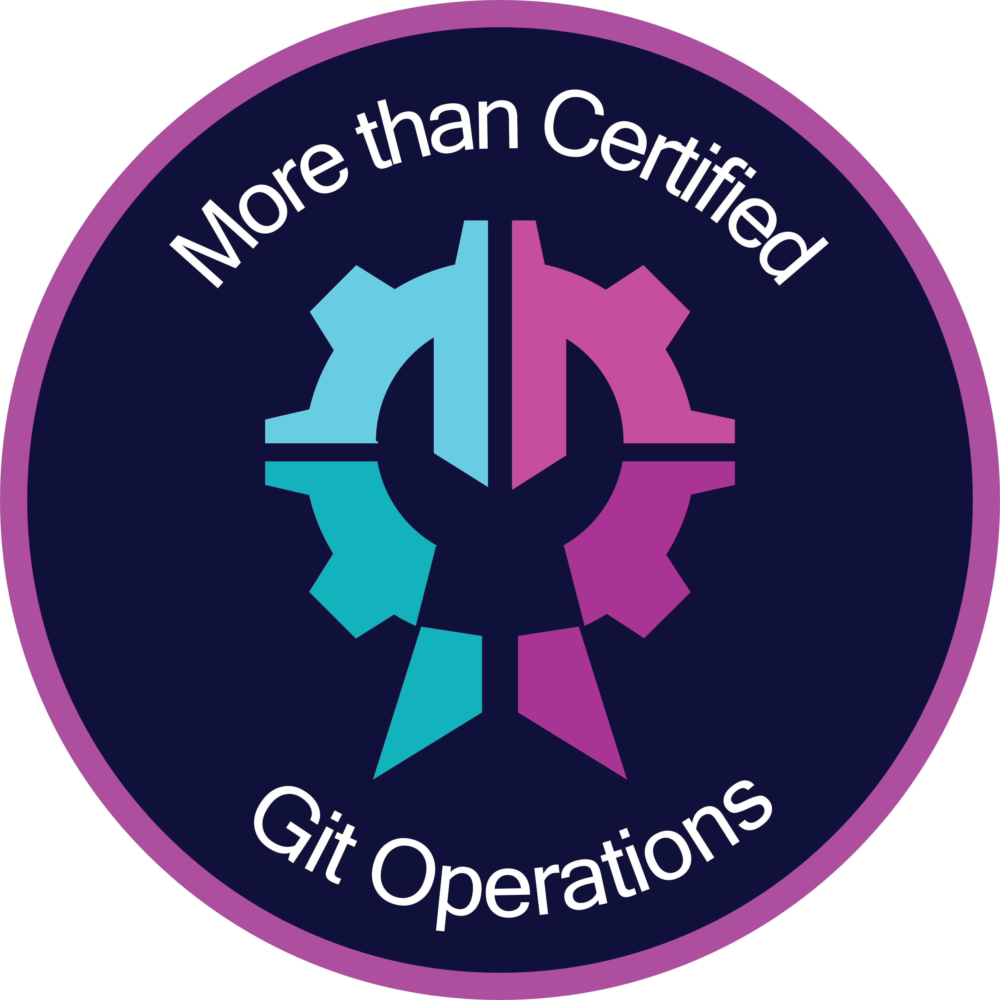

### Hey, I'm Kieran! 👋

I have a keen interest in DevSecOps, CI/CD, AWS, IaC, Terraform, OpenTofu and everything automation!

- :speech_balloon: Pronounced as: *Keer-un*
- 😄 Pronouns: he/him/his
- 🤔 Ask me about: OpenTofu, Terraform, AWS, CICD, GitHub Actions
- 🌐 Check out my tech blog at: <https://kieranlowe.io>
  - You can find direct links to some of my blog posts at [Blog Posts](#blog-posts)
- 📫 How to reach me: <hello@kieranlowe.me>

### My Credly Badges

<!--START_SECTION:badges-->

")

")
<!--END_SECTION:badges-->

### Other Badges

  
  

### Blog Posts

| Name | Link | Date | Location |
|------|------|------|----------|
| Terraform S3 Backend Setup: Skip the Table | [here](https://kieranlowe.io/terraform-s3-backend-setup-skip-the-table) | 16th December 2024 | kieranlowe.io |
| Supporting both OpenTofu and Terraform in Your Modules | [here](https://kieranlowe.io/supporting-both-opentofu-and-terraform-in-your-modules) | 4th December 2024 | kieranlowe.io |
| Implementing Self-Hosted GitHub Action Runners using AWS CodeBuild | [here](https://kieranlowe.io/implementing-self-hosted-github-action-runners-using-aws-codebuild) | 19th November 2024 | kieranlowe.io |
