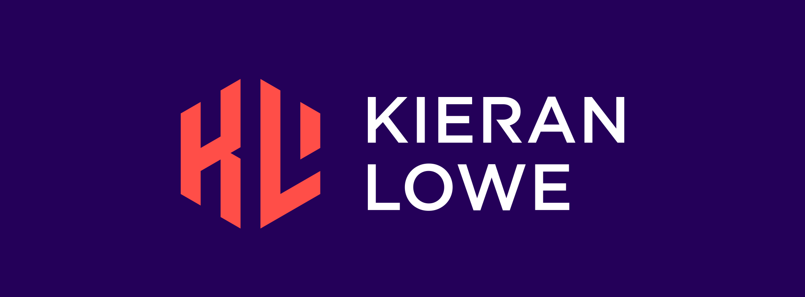

### Hey, I'm Kieran! 👋

A Public Cloud Engineer involved in solution architecture and development in AWS to drive transformation. I have a keen interest in DevSecOps, CI/CD, AWS, Terraform and everything automation!

- :speech_balloon: Pronounced as: *Keer-un*
- 😄 Pronouns: he/him/his
- 🤔 Ask me about: Terraform, AWS
- 🌐 Check out my tech blog at: <https://klowe.io>
- 📫 How to reach me: hello@kieranlowe.me

<!--
**lowekie/lowekie** is a ✨ _special_ ✨ repository because its `README.md` (this file) appears on your GitHub profile.

Here are some ideas to get you started:

- 🔭 I’m currently working on ...
- 🌱 I’m currently learning ...
- 👯 I’m looking to collaborate on ...
- 🤔 I’m looking for help with ...
- 💬 Ask me about ...
- 📫 How to reach me: ...
- 😄 Pronouns: ...
- ⚡ Fun fact: ...
-->

